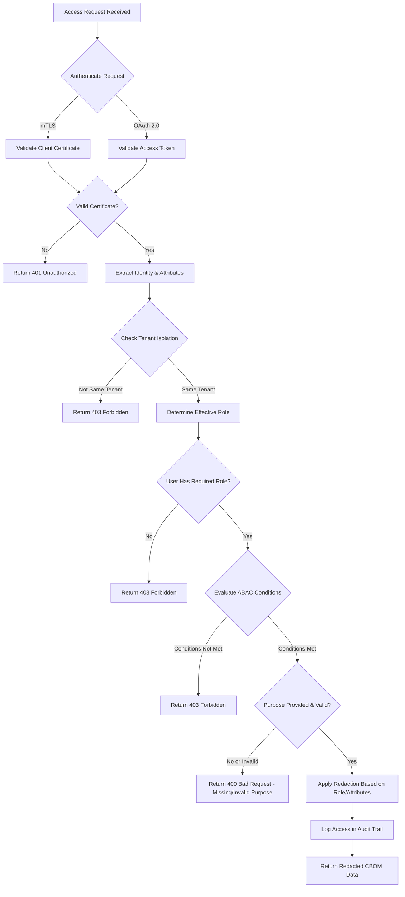

# CBOM Access Control and Redaction Policy

## Overview

This document specifies the access control model and redaction policy for Cryptographic Bill of Materials (CBOM) data in the Teos Quantum-Safe Orchestration Layer. A CBOM contains sensitive information about an organization's cryptographic assets, including key locations, algorithms in use, and potential vulnerabilities. This policy ensures that CBOM data is accessible only to authorized personnel while protecting sensitive information through appropriate redaction mechanisms.

## Security Objectives

1. **Confidentiality**: Protect sensitive cryptographic asset information from unauthorized disclosure
2. **Integrity**: Ensure CBOM data is accurate and has not been tampered with
3. **Availability**: Ensure authorized users can access CBOM data when needed for legitimate purposes
4. **Accountability**: Maintain audit trail of all CBOM access and operations
5. **Minimization**: Limit access to the minimum necessary information for legitimate business purposes

## Access Control Model

### Authentication Mechanisms

The system supports two primary authentication mechanisms for CBOM access:

#### mTLS Mutual Authentication
- **Use Case**: Service-to-service communication, automated systems, machine-to-machine authentication
- **Requirements**:
  - Valid X.509 certificate issued by organization's PKI
  - Certificate must contain appropriate Subject Alternative Names (SANs) or Subject DN
  - Certificate must be valid and not expired/revoked
  - Peer validation required (both parties authenticate each other)
- **Cipher Suites**: TLS_ECDHE_ECDSA_WITH_AES_256_GCM_SHA384 or equivalent forward-secret suites
- **Certificate Validation**: Full chain validation including OCSP/CRL checking

#### OAuth 2.0 with OpenID Connect
- **Use Case**: User-initiated access, web interfaces, mobile applications, API clients
- **Flow**: Authorization Code Flow with PKCE (for public clients) or Client Credentials Flow (for confidential clients)
- **Token Type**: JWT access tokens with appropriate claims
- **Token Lifetime**: Short-lived access tokens (15-60 minutes) with refresh token rotation
- **Signature Algorithm**: ES256 or RS256
- **Issuer**: Organization's authorized identity provider

### Authorization Model

Access control is based on a combination of:
1. **Role-Based Access Control (RBAC)**
2. **Attribute-Based Access Control (ABAC)**
3. **Tenant Isolation** (in multi-tenant deployments)
4. **Purpose-Based Access Control**

#### Roles and Permissions

| Role | Permissions | Description |
|------|-------------|-------------|
| **CBOM Reader** | `cbom.read` | Read access to CBOM snapshots with standard redaction applied |
| **CBOM Auditor** | `cbom.read`, `cbom.audit` | Read access to CBOM snapshots with reduced redaction (for compliance purposes) |
| **CBOM Operator** | `cbom.read`, `cbom.write` | Full read access plus ability to trigger CBOM generation |
| **CBOM Administrator** | `cbom.read`, `cbom.write`, `cbom.admin` | Full access including configuration management |
| **System Administrator** | `*` | Full system access (limited to emergency break-glass scenarios) |

#### Attributes for ABAC

Access decisions consider the following attributes:
- **Subject Attributes**: User role, group membership, authentication level, clearance level
- **Resource Attributes**: CBOM classification, data sensitivity, tenant association, timestamp
- **Environment Attributes**: Time of day, location, threat level, network zone
- **Action Attributes**: Requested operation, data fields being accessed

#### Policy Decision Points

Access decisions are made based on the following rules (in order of precedence):

1. **Deny by Default**: All access is denied unless explicitly permitted
2. **Explicit Deny**: Any matching deny rule overrides permit rules
3. **Tenant Isolation**: Users can only access CBOM data from their own tenant (in multi-tenant deployments)
4. **Role Permissions**: User must have a role that permits the requested action
5. **Attribute Conditions**: All specified attribute conditions must be met
6. **Purpose Justification**: User must provide a valid business purpose for access
7. **Time of Day Restrictions**: Access may be limited to business hours for certain roles
8. **Location Restrictions**: Access may be restricted to specific network zones or geolocations
9. **Threat Level Adjustments**: During elevated threat levels, access requirements may be increased

### Authorization Implementation

#### API Endpoint Protection

All CBOM-related API endpoints enforce authorization:

- `GET /cbom/snapshot`: Requires `cbom.read` scope/role
- `POST /algorithms/register`: Requires `cbom.write` scope/role
- `POST /keys/rotate`: Requires `cbom.write` scope/role

#### Token Validation

For OAuth 2.0:
- Validate token signature using issuer's public key
- Verify token expiration (`exp` claim)
- Verify token Not Before (`nbf` claim)
- Verify audience (`aud`) matches the service
- Verify issuer (`iss`) is trusted
- Validate required scopes/roles are present in token
- Check token revocation status (if implemented)

For mTLS:
- Validate certificate chain to trusted root
- Check certificate validity period
- Verify certificate is not revoked (OCSP/CRL)
- Map certificate subject to user/role identity
- Validate client certificate presents required attributes for authorization

## Redaction Policy

### Redaction Principles

1. **Need-to-Know Basis**: Only reveal information necessary for the authorized purpose
2. **Graduated Transparency**: Different roles see different levels of detail
3. **Consistent Application**: Redaction rules applied uniformly across all access methods
4. **Reversible for Authorized Parties**: Authorized roles can request less-redacted views
5. **Audit Trail Integrity**: Redaction decisions are logged in the immutable audit trail

### Redaction Levels

| Level | Description | Applicable Roles | Redacted Fields |
|-------|-------------|------------------|-----------------|
| **Full Redaction** | Minimal information - confirms asset exists but hides sensitive details | CBOM Reader (basic) | `location`, `key_size_bits` (for keys), detailed `usage`, full `notes` |
| **Partial Redaction** | Standard view - shows non-sensitive details, hides critical secrets | CBOM Reader (standard), CBOM Auditor | `location` (specific paths/hsm slots), full `notes` (may show summary) |
| **Limited Redaction** | Reduced redaction - shows more operational details | CBOM Auditor, CBOM Operator | Specific `location` details (may show type but not exact path), sensitive `notes` portions |
| **No Redaction** | Full detail - shows all information | CBOM Administrator (subject to additional controls), System Administrator (emergency only) | None (all fields visible) |

### Field-Specific Redaction Rules

| Field | Redaction Rule | Rationale |
|-------|----------------|-----------|
| `asset_id` | Never redacted (but may be pseudonymized for external sharing) | Required for asset tracking and correlation |
| `asset_type` | Never redacted | Non-sensitive classification information |
| `name` | Never redacted | Human-readable identifier needed for operations |
| `location` | **Full Redaction**: `<REDACTED>` **Partial Redaction**: Show type only (e.g., `HSM`, `filesystem`, `cloud_kms`) **Limited Redaction**: Show type and general category (e.g., `HSM:slot_range_0x0001-0x0010`) **No Redaction**: Full path or identifier | Location information combined with other data could enable physical or logical attacks |
| `classical_or_pq` | Never redacted | Essential for risk assessment and migration planning |
| `algorithm_family` | **Partial Redaction**: Show family only (e.g., `ML-KEM`) **Limited Redaction**: Show family and security level (e.g., `ML-KEM-768`) **No Redaction**: Full parameter set (e.g., `ML-KEM-768`) | Specific parameter sets may reveal implementation details useful to attackers |
| `key_size_bits` | **Full Redaction**: `<REDACTED>` **Partial Redaction**: Show range (e.g., `2048-3072` for RSA, `256-384` for ECC) **Limited Redaction**: Show exact value **No Redaction**: Exact value | Key size information helps attackers estimate attack costs |
| `usage` | **Full Redaction**: Show category only (e.g., `encryption`, `signing`) **Partial Redaction**: Show specific protocol/use case (e.g., `TLS 1.3`, `code signing`) **Limited Redaction**: Show detailed usage with context **No Redaction**: Full usage description | Usage context combined with location and algorithm could reveal attack vectors |
| `crypto_agility_status` | Never redacted | Important for migration planning and risk assessment |
| `quantum_vulnerable` | Never redacted | Critical for risk assessment and prioritization |
| `migration_priority` | Never redacted | Essential for migration planning and resource allocation |
| `notes` | **Full Redaction**: `[REDACTED - CONTACT SECURITY TEAM FOR DETAILS]` **Partial Redaction**: Show first 50 characters + `[...]` if longer **Limited Redaction**: Show first 100 characters + `[...]` if longer **No Redaction**: Full text | Notes may contain sensitive operational details, configuration information, or security context |

### Special Redaction Considerations

#### Hybrid Assets
For hybrid assets (e.g., X25519+ML-KEM-768):
- The `algorithm_family` field shows the combined representation
- Individual component details are not exposed in the main CBOM
- Authorized roles with appropriate justification can request component-level views
- Component relationships are visible through the `teos:hybridComponents` extension property

#### Key Sizes
Key sizes are particularly sensitive as they directly relate to attack feasibility:
- Public key sizes for asymmetric algorithms are less sensitive than private key sizes
- For public keys, less redaction may be appropriate
- For private keys or symmetric keys, stricter redaction applies
- The policy treats all `key_size_bits` fields with the same sensitivity for simplicity

#### Location Information
Location sensitivity varies by storage type:
- **HSM Slots**: Extremely sensitive - always redacted beyond type
- **Filesystem Paths**: Moderately sensitive - show directory structure but not exact filenames in partial redaction
- **Cloud KMS**: Moderately sensitive - show service and key group but not key IDs or ARNs
- **Source Code**: Sensitive - show module/package but not exact lines or implementations
- **Hardware Security Modules**: Very sensitive - show vendor/model but not exact configuration

### Redaction Implementation

#### API-Based Redaction
Redaction is applied at the API response level:
1. Authenticated and authorized request processed
2. CBOM data retrieved from secure storage
3. Redaction rules applied based on subject's role/attributes
4. Redacted response returned to client
5. Original data never leaves secure storage boundary
6. Redaction decision logged in audit trail

#### Redaction Consistency
Ensures consistent application through:
- Centralized redaction engine
- Role-to-redaction-level mapping table
- Regular audits of redaction application
- Automated testing of redaction logic

## Access Control and Redaction Workflow

### Access Request Flow

### Emergency Access Procedure
For genuine emergency situations requiring access beyond normal controls:

1. **Break-Glass Account**: Use of special emergency account with elevated privileges
2. **Multi-Party Approval**: Requires approval from at least two authorized executives
3. **Time-Limited Access**: Access granted for limited duration (e.g., 1 hour)
4. **Full Audit Trail**: All actions logged with emergency context clearly marked
5. **Post-Incident Review**: Mandatory review after emergency access usage
6. **Credential Rotation**: Emergency credentials rotated after each use
7. **Geofencing**: Emergency access may be restricted to specific physical locations

### External Sharing Controls
When CBOM data must be shared with external parties (auditors, regulators, partners):

1. **Purpose Limitation**: Sharing only for explicitly authorized purposes
2. **Minimum Necessary**: Share only the minimum information required
3. **Redaction First**: Apply appropriate redaction before transmission
4. **Encryption in Transit**: Use TLS 1.3 or equivalent for transmission
5. **Encryption at Rest**: Encrypt received copies if storage is required
6. **Usage Restrictions**: Legally binding agreements limiting use to specified purpose
7. **Return/Destruction**: Require return or secure destruction after use period
8. **Audit Trail**: External sharing events logged with full context

## Policy Enforcement and Monitoring

### Technical Controls
- **Policy Decision Point (PDP)**: Centralized service evaluating access requests
- **Policy Enforcement Point (PEP)**: API gateways and application services enforcing decisions
- **Policy Information Point (PIP)**: Sources of attribute information (identity stores, context services)
- **Secure Logging**: All access decisions logged to immutable audit trail

### Monitoring and Alerting
- **Access Anomaly Detection**: Machine learning models detecting unusual access patterns
- **Privilege Escalation Monitoring**: Alerts on attempts to gain higher access levels
- **Failed Access Attempts**: Alerts on repeated failed authentication/authorization
- **Emergency Access Usage**: Immediate notification when emergency accounts are used
- **External Sharing Alerts**: Notifications when CBOM data is shared externally
- **Redaction Anomalies**: Detection of potential over-redaction or under-redaction

### Regular Reviews
- **Access Review**: Quarterly review of all user roles and permissions
- **Policy Review**: Annual review of this policy against emerging threats and regulations
- **Redaction Effectiveness**: Semi-annual testing of redaction efficacy
- **Access Control Testing**: Regular penetration testing of access controls
- **Audit Trail Integrity**: Continuous verification of audit trail hash chain

## Compliance Mapping

This access control and redaction policy supports compliance with:

- **NIST SP 800-53**: AC-2, AC-3, AC-4, AC-5, AC-6, AC-14, AC-16, AC-17, AC-19, AC-20, AC-24
- **NIST SP 800-57 Part 3**: Key management access controls
- **ISO 27001**: A.9.1, A.9.2, A.9.3, A.9.4, A.12.4.1, A.12.4.2, A.12.4.3
- **PCI DSS**: Requirements 7, 8, 9, 10, 12
- **HIPAA**: § 164.308(a)(4), § 164.310(a)(2)(ii), § 164.312(a)(1), § 164.312(b)
- **GDPR**: Articles 5, 25, 32
- **SOC 2**: CC6.1, CC6.2, CC6.3, CC6.5, CC7.1, CC7.2
- **FedRAMP**: AC-2, AC-3, AC-6, AC-14, SC-7, SC-8, SC-12, SC-13

## Implementation Requirements

### Technical Implementation
1. **Centralized Authorization Service**: Implement PDP/PGP architecture
2. **Secure Identity Provider**: Integrate with enterprise IdP (Azure AD, Okta, etc.)
3. **Certificate Management**: Automated certificate lifecycle management for mTLS
4. **Secure Storage**: Hardware Security Modules or encrypted storage for CBOM data
5. **Immutable Audit Log**: Write-once storage or append-only logging system
6. **Redaction Engine**: Centralized service applying redaction rules consistently

### Operational Procedures
1. **Onboarding/Offboarding**: Automated processes for role assignment and removal
2. **Periodic Recertification**: Regular manager review of direct reports' access
3. **Privileged Access Management**: Special controls for administrative access
4. **Security Training**: Regular training on data handling and access policies
5. **Incident Response**: Procedures for suspected unauthorized access or data breaches

### Testing and Validation
1. **Penetration Testing**: Regular external and internal penetration tests
2. **Redaction Testing**: Automated tests verifying correct redaction application
3. **Access Control Testing**: Testing of all role/attribute combinations
4. **Break-Glass Testing**: Regular testing of emergency access procedures
5. **Red Team Exercises**: Periodic adversarial testing of access controls

## Policy Exceptions and Waivers

### Exception Process
Exceptions to this policy require:
1. **Written Request**: Detailed business justification
2. **Risk Assessment**: Formal evaluation of risks and mitigations
3. **Compensating Controls**: Additional controls to offset increased risk
4. **Approval**: Signature from CISO, CRO, and General Counsel
5. **Time Limitation**: Exceptions granted for specific duration only
6. **Review Schedule**: Regular review dates specified in exception documentation
7. **Documentation**: Exception stored in centralized policy exception registry

### Emergency Situations
In declared emergencies (natural disaster, cyber attack, etc.):
- Temporary adjustments may be made by Incident Commander
- All adjustments must be documented and justified
- Normal policy restored as soon as practicable
- Post-incident review required to assess effectiveness and lessons learned

## Review and Update

### Review Cycle
- **Basic Review**: Annual review of policy effectiveness
- **Trigger-Based Review**: Review following:
  - Security incidents involving access control
  - Significant changes in threat landscape
  - New regulatory requirements
  - Major architectural changes to CBOM system
  - Annual penetration test findings

### Update Procedure
1. **Draft Changes**: Policy owner prepares proposed changes
2. **Stakeholder Review**: Review by legal, compliance, security, and business stakeholders
3. **Legal Review**: Final review by legal counsel
4. **Approval**: Approval by CISO and/or appropriate governance body
5. **Communication**: Distribution to all affected parties
6. **Training**: Training sessions on changes if significant
7. **Implementation**: Updates made to technical controls and documentation
8. **Effective Date**: Clearly specified date when changes take effect

## References

- NIST SP 800-53 Rev. 5: Security and Privacy Controls for Information Systems and Organizations
- NIST SP 800-57 Part 3 Rev. 1: Recommendation for Key Management: Application-Specific Key Management Guidance
- NIST SP 800-63B: Digital Identity Guidelines: Authentication and Lifecycle Management
- ISO/IEC 27001:2022: Information Security, Cybersecurity and Privacy Protection
- ISO/IEC 27002:2022: Information Security Controls
- PCI DSS v4.0: Payment Card Industry Data Security Standard
- HIPAA Security Rule: 45 CFR Parts 160 and 164
- GDPR: Regulation (EU) 2016/679 of the European Parliament and of the Council